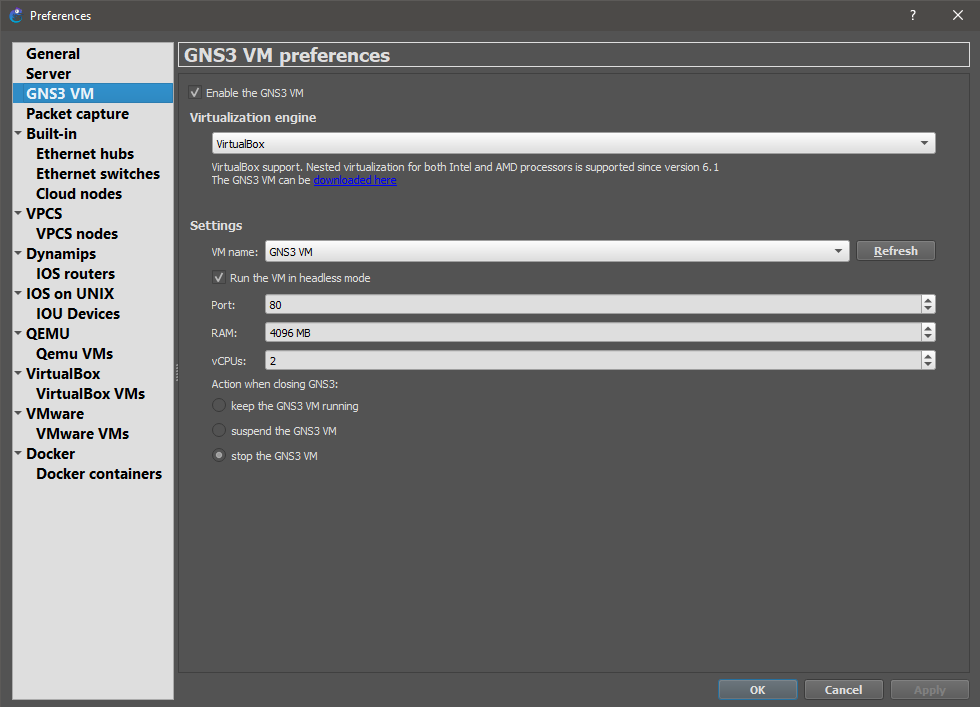
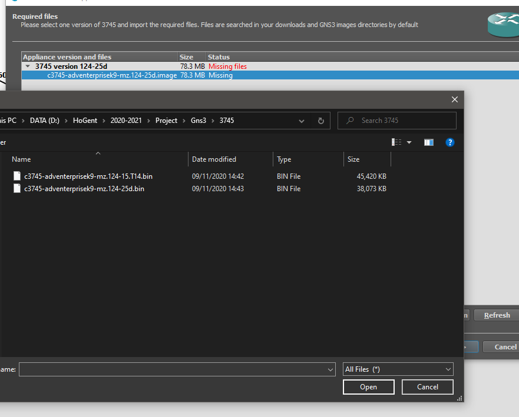
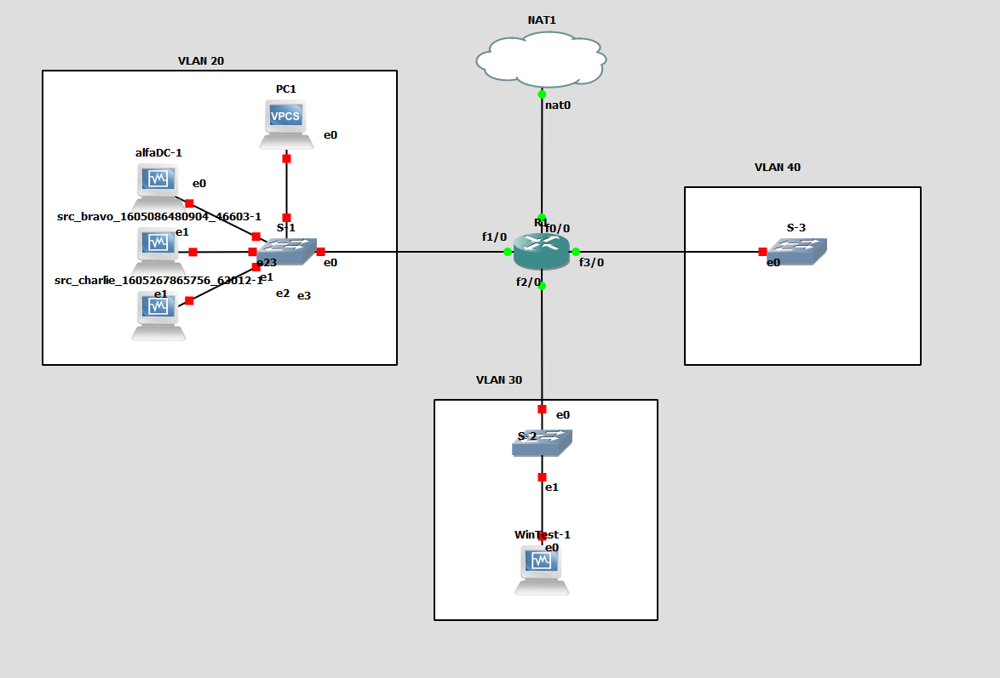

# GNS3
## Installatie GNS3
- Volg installatieproces, doe op zich niks speciaal
- Download de GNS3 VM (liefst Virtualbox)
- Nieuwste versie virtualbox nodig, vanaf 6.1 zou moeten werken
- Pak de GNS3 VM uit en laat alle opties default (qua adapters etc)
- Start de VM in virtualbox, en kijk wat de versie is. De versie van de VM moet overeenkomen met de versie van GNS3.
- Sluit de VM terug.
- Open GNS3 en ga naar about en controleer of de versie van GNS3 overeenkomt met die in de VM.

## Integratie VM
- Open GNS3
- Edit > preferences
- Gebruik deze instellingen. Er kan eventueel nog iets meer RAM gegeven worden maar dit is absoluut het minimum.

- Nu zou de VM moeten opstarten als je op apply klikt. Indien niet is er iets misgegaan (kijk in virtualbox of de vm starting/running is zonder er zelf op te klikken)

## Installatie Images
- Download [hier](https://drive.google.com/drive/folders/102jxZ9ECpe6ZFtXYdK_81iEVuuFoGOGR) de nodige images.
- De images voor de l2 switch zijn beschikbaar op de fileserver (zie info fileserver jorn)
- We hebben zeker een image van een router (bijv 3745) en een l2 switch nodig (liefst 2960), download hiervan al de files.
### 2960:
- Edit
- preferences
- QEMU VMs
- new
- Kies voor run on the VM
- Naam: 2960
- 1 gb RAM, of meer afhankelijk van hoeveel beschikbaar is 
- new image -> selecteer de gedownloade bin file.
- De appliance zou moeten geïnstalleerd zijn
### 3745:
- Voor de 3745 is het iets moeilijker. Ga naar routers > new template > Install an appliance from the GNS3 Server > ga naar routers en selecteer de 3745 -> install on the vm
- Klik op de "missing files" en import, navigeer naar de locatie waar u de images gedownload hebt en import. Allow ook custom files.

- Loop nu verder door de wizard en het apparaat zou beschikbaar moeten zijn. Deze aanpak kan ook gebruikt worden om nog extra devices toe te voegen

## Importeren VM's
- Edit > preferences
- Ga naar Virtualbox VM's
- New > run on this local computer > wacht totdat GNS3 de lijst van vm's geïmporteerd heeft vanuit Virtualbox
- Kies de juiste vm en import
- Ga nu naar edit.
- Voor sommige vm's (voornamelijk de linuxmachines) hoeven we geen virtuele desktop te openen met virtualbox elke keer we deze opstarten. Daarvoor kan je de optie "start in headless mode" aanvinken.
- Ga nu naar network
- Vink "Allow GNS3 to use any configured virtualbox adapter" aan.
- Klik op ok
- VM is geïmporteerd!

## Configuratie cisco apparatuur
### Opstelling
- Reproduceer de opstelling uit deze afbeelding:
- Voeg voldoende 1FE-TX modules toe aan de router, en configureer een voldoende aantal adapters voor de 2960

## R1
- ip nat inside source list 1 interface f 0/0 overload
- access-list 1 permit  0.0.0.0 255.255.255.255
- int f0/0
- ip nat outside
- ip address dhcp
- no sh
- int f1/0
- ip nat inside
- no sh
- int f1/0.20
- encapsulation dot1Q 20 native
- ip address 192.168.55.1 255.255.255.248
- int f2/0
- ip nat inside
- no sh
- int f2/0.30
- encapsulation dot1q 30 native
- ip helper-address 192.168.55.2
- ip address 192.168.55.9 255.255.255.248
- ip nat inside
- int f3/0
- ip nat inside
- no sh
- int f3/0.40
- encapsulation dot1q 40 native
- ip address 192.168.55.17 255.255.255.248
- ip dhcp pool GUESTPOOL
- network 192.168.55.16 255.255.255.248
- default-router 192.168.55.17
- dns-server 192.168.55.3
- domain-name corona2020.local
- ip access-list standard RESTRICT_VLAN_40
- deny 192.168.55.16 0.0.0.7
- permit any
- int f1/0.20
- ip access-group RESTRICT_VLAN_40 out

## S1
- conf t
- int g0/0
- no negotiation auto
- duplex full
- exit
- hostname S1
- exit
- copy run sta

## S2
- conf t
- int g0/0
- no negotiation auto
- duplex full
- exit
- hostname S2
- exit
- copy run sta

## S3
- conf t
- int g0/0
- no negotiation auto
- duplex full
- exit
- hostname S3
- exit
- copy run sta
