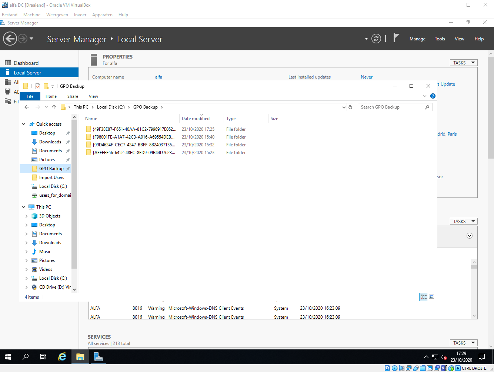

# Documentatie Domain Controller

## Inhoud documentatie

* Als eerste werd onze Windows Server 2019 geinstaleerd, dan hebben we de naam veranderd van de server via een script met 1 commando `RenameComputer`.
* Zodra de DC terug is opgestart gaan we de Active Directory Domain Services Role gaan toevoegen aan deze om er een echte Domain controller van te maken dit wordt gedaan via het script `AddADDSRole`
* Als volgt zal ik de DHCP Role gaan toevoegen aan onze Domain Controller via het script `AddDHCPRole`
* We gaan nu vanwege de Group Polices later Organizational Units aanmaken en dan daarna onze aparte groepen toevoegen aan deze aparte Organizational Units. Dit gebeurd allemaal via 2 heel eenvoudige scripts.
* Als volgende stap heb ik opzoekwerk gedaan om uit te vinden hoe je Users in bulk kan toevoegen aan je Active Directory met een csv file & gebruik makende van Powershell.
* Als opvolging op dit opzoekwerk is er een script geschreven om Users in bulk toe te voegen met behulp van een csv file.
* Ik heb hierna ook even een klein scriptje geschreven zodat elke User dat we gemaakt hebben ook nog eens aan een aparte groep wordt toegevoegd (VB: Sven De Vuyst toegevoegd aan departement Administratie)
* Nu gaan we verder met het automatisch aanmaken van enkele computers via een scriptje om ze daarna met een andere scriptje ook meteen toe te voegen aan hun respectievelijke groepen, dit alles kan waarschijnlijk wel in 1 script gebeuren. We gebruiken hiervoor ook een CSV File.
* We gaan nu beginnen aan onze Group Policies uit te werken. Er zijn een aantal restricties waar we aan moeten voldoen. Hier wordt weer gebruikt gemaakt van een Powershell script om een aantal dingen automatisch te laten gebeuren.
* Er werd een lokale testomgeving opgezet (DC kloon + DNS) om de group policies eens uit te testen. 2/4 Group Policies werken op dit moment. (`VerbiedToegangTotControlPanel` en `VerbiedToegangTotNetwerkAdapters`)

* Ik heb als eerste een powershell script gemaakt `GroupPolicies.ps1`, Ik voer van dit script enkel de eerste 15 lijnen uit hierdoor worden de verschillende Group Policies leeg aangemaakt, hierna heb ik even handmatig de verschillende restricties bij de Group Policies aangezet. 
* Nu dat de restricties aanstaan heb ik van elk Group Policy Object een backup gemaakt en in een Folder op de DC gestoken: `C:\GPO Backup`
* Nu dat we alle backups hebben zullen we om te testen alle group policies weer verwijderen, hierna voer ik het volledige script `GroupPolicies.ps1` uit en zullen alle Group Policies weer tevoorschijn komen.
* We kijken nu of alle restricties nog aan staan en als alles goed is gegaan staan ze allemaal nog hetzelfde geconfigureerd.
* Work In Progress...

    - Link naar Powershell script (RenameComputer): [Powershell RenameComputer](./RenameComputer.ps1)
    - Link naar Powershell script (AddADDSRole): [Powershell AddADDSRole](./AddADDSRole.ps1)
    - Link naar Powershell script (AddDHCPRole): [Powershell AddDHCPRole](./AddDHCPRole.ps1)
    - Link naar Powershell script (AddOUs): [Powershell AddOUs](./AddOUs.ps1)
    - Link naar Powershell script (AddGroups): [Powershell AddGroups](./AddGroups.ps1)
    - Link naar CSV file voor Users: [CSV File Users](./test.csv)
    - Link naar Powershell script (AddNewUsers): [Powershell Script AddNewUsers](./AddNewUsers.ps1)
    - Link naar Powershell script (AddUsersToGroups): [Powershell AddUsersToGroups](./AddUsersToGroups.ps1)
    - Link naar CSV file voor Computers: [CSV File Computers](./AddComputers.csv)
    - Link naar Powershell script (AddComputers): [Powershell Script AddComputers](./AddComputers.ps1)
    - Link naar Powershell script (AddComputersToGroups): [Powershell AddComputersToGroups](./AddComputersToGroups.ps1)
    - Link naar Powershell script voor Group Policy: [Powershell GroupPolicies](./GroupPolicies.ps1)

## Bronnen

- Hier zijn een aantal links die ik tot nu toe gebruikt heb om een aantal taken te realizeren:
    - https://www.petenetlive.com/KB/Article/0001475
    - https://blogs.manageengine.com/active-directory/admanager/2019/07/31/how-to-create-bulk-users-in-active-directory-using-a-csv-file.html
    - https://www.risual.com/2015/07/bulk-create-computer-accounts-with-powershell/
    - https://www.manageengine.com/products/ad-manager/powershell/script-create-computer-accounts-in-ad.html
    - https://devblogs.microsoft.com/scripting/powertip-add-computer-to-security-group-with-powershell/
    - https://docs.microsoft.com/en-us/powershell/module/addsadministration/new-adorganizationalunit?view=win10-ps
    - https://docs.microsoft.com/en-us/powershell/module/addsadministration/new-adgroup?view=win10-ps
    - https://docs.microsoft.com/en-us/powershell/module/grouppolicy/new-gplink?view=win10-ps
    - https://docs.microsoft.com/en-us/powershell/module/grouppolicy/new-gpo?view=win10-ps
    - https://sid-500.com/2017/08/25/configuring-group-policies-by-using-windows-powershell/
    - https://docs.microsoft.com/en-us/powershell/module/grouppolicy/set-gppermission?view=win10-ps
    - https://www.prajwaldesai.com/disable-control-panel/
    - https://deployhappiness.com/block-the-control-panel-group-policy/
    - https://sid-500.com/2017/08/25/configuring-group-policies-by-using-windows-powershell/
    - https://docs.microsoft.com/en-us/powershell/module/grouppolicy/import-gpo?view=win10-ps
    - https://blog.netwrix.com/2019/04/11/top-10-group-policy-powershell-commands/
    - https://docs.microsoft.com/en-us/powershell/module/addsadministration/add-adgroupmember?view=win10-ps
    - https://community.spiceworks.com/how_to/50409-add-ad-user-to-groups-with-powershell
    - https://activedirectorypro.com/create-bulk-users-active-directory/
    - https://subscription.packtpub.com/book/networking_and_servers/9781784398729/2/ch02lvl1sec15/exporting-gpo-from-active-directory
    - https://social.technet.microsoft.com/Forums/Windows/en-US/31b7d136-a1ab-4e24-84e2-777899dd049e/restrict-local-admins-from-viewingchanging-network-properties?forum=winserverGP
    - https://mcpmag.com/articles/2008/10/13/file-permissions-thru-group-policy.aspx
    - https://enterinit.com/windows-server-2016-gpo-create-file-system-security/amp/
    - https://medium.com/@eeubanks/install-ad-ds-dns-and-dhcp-using-powershell-on-windows-server-2016-ac331e5988a7
    - https://docs.microsoft.com/en-us/powershell/module/addsdeployment/install-addsforest?view=win10-ps
    - https://rdr-it.com/en/active-directory-add-a-domain-controller-to-powershell/
    - https://www.rebeladmin.com/2018/10/step-step-guide-install-active-directory-windows-server-2019-powershell-guide/
    - http://woshub.com/powershell-configure-windows-networking/
    - https://docs.microsoft.com/en-us/powershell/module/nettcpip/set-netipinterface?view=win10-ps
    - https://docs.microsoft.com/en-us/powershell/module/nettcpip/new-netipaddress?view=win10-ps
    - https://docs.microsoft.com/en-us/powershell/module/addsdeployment/install-addsdomaincontroller?view=win10-ps
    - https://www.jorgebernhardt.com/how-to-rename-computer-with-powershell/
    - https://docs.microsoft.com/en-us/powershell/module/microsoft.powershell.management/rename-computer?view=powershell-7
    - https://www.faqforge.com/windows/configure-dhcp-powershell/
    - https://docs.microsoft.com/lb-lu/powershell/module/dhcpserver/add-dhcpserverindc?view=win10-ps#:~:text=%5B%5D-,Description,services%20in%20the%20Active%20Directory.
    - https://docs.microsoft.com/en-us/powershell/module/dhcpserver/add-dhcpserverv4scope?view=win10-ps
    - https://docs.microsoft.com/en-us/powershell/module/dhcpserver/set-dhcpserverv4optionvalue?view=win10-ps
    - https://docs.microsoft.com/en-us/powershell/module/dhcpserver/set-dhcpserverv4scope?view=win10-ps
    - https://docs.microsoft.com/en-us/powershell/module/dhcpserver/add-dhcpserverv4exclusionrange?view=win10-ps
    - https://social.technet.microsoft.com/Forums/en-US/1649bb53-2a74-46ad-88ad-0466d92fe1fa/how-can-i-use-powershell-to-quotcomplete-dhcp-configurationquot-?forum=winserver8setup
    - https://4sysops.com/archives/run-powershell-scripts-as-immediate-scheduled-tasks-with-group-policy/
    - https://answers.microsoft.com/en-us/windows/forum/all/how-to-disable-microsoft-solitaire-collection/1b82f2ee-6b36-4f7d-94f4-e27a6663ba64
    - https://community.spiceworks.com/topic/1182462-windows-10-block-app-store-games
    - https://social.technet.microsoft.com/Forums/en-US/fd8932a7-64bf-4c8f-8321-becec9bc5db0/remove-games-via-group-policy-or-other-methods?forum=win10itprosetup
    - https://community.spiceworks.com/topic/1408834-removing-windows-10-apps-gpo
    - https://www.tenforums.com/tutorials/4689-uninstall-apps-windows-10-a.html
    - https://www.techrepublic.com/article/how-to-manage-your-organizations-microsoft-store-group-policy/
    - https://ccmexec.com/2015/08/blocking-built-in-apps-in-windows-10-using-applocker/ 
    - https://community.spiceworks.com/topic/1987607-how-can-i-remove-games-on-a-win-10-pc-through-gpo
    - https://www.techrepublic.com/blog/the-enterprise-cloud/network-shares-group-policy-configuration-notes/
    - https://infosystir.blogspot.com/2013/11/mapping-drives-with-group-policy-to-dfs.html#:~:text=Group%20Policy%20Drive%20Mapping%3A,this%20case%20it's%20%5C%5Cdomain.
    - https://www.vembu.com/blog/distributed-file-system-dfs-windows-server-2016-brief-overview/
    - https://wdmbr.wordpress.com/2019/02/05/install-and-configure-distributed-file-system-dfs-on-windows-server-2012-r2-2016/
    - https://docs.microsoft.com/en-us/powershell/module/dfsn/new-dfsnroot?view=win10-ps
    - https://docs.microsoft.com/en-us/windows-server/storage/dfs-namespaces/create-a-dfs-namespace
    - https://docs.microsoft.com/en-us/powershell/module/dfsn/new-dfsnfolder?view=win10-ps
    - https://activedirectorypro.com/map-network-drives-with-group-policy/
    - https://www.faqforge.com/windows/map-shared-folder-network-drive-using-group-policy/

## Screenshots

Hier zal je enkele screenshots te zien krijgen van het werk tot nu toe:

### Active Directory Domain Services & Rename Computer

### DHCP Role

### Active Directory Organizational Units

### Active Directory Users & Groups 

### Active Directory Computers

### Active Directory GroupProperties

### Group Policies

### Group Policy Objects

### Testing Group Policy (VerbiedToegangTotNetwerkAdapters)

### Testing Group Policy (VerbiedToegangTotControlPanel)

## Voorlopige Test Group Policy (FileSystemDFSVoorUsers)

- Dit is maar een voorlopig resultaat aangezien ik hier nog niet volledig mee klaar ben en er nog wat hulp bij nodig heb. 
    - De DFS Role werd automatisch toegevoegd aan de hand van een powershell script `AddDFSRole`.
    - Hierna heb ik met de GUI van DFS Management een Standalone namespace aangemaakt en in deze namespace dan een nieuwe folder `\\alfa\TestShare\Testing` die gelinkt is met `C:\Shares`.
    - In deze gelinkte folder heb ik een tekstfile `test` gestoken om te zien of deze ook zou verschijnen op onze users die we eerder hebben aangemaakt op de DC.
    - Hierna zijn we terug naar onze Group Policy `FileSystemDFSVoorUsers` gegaan en navigeren we ons naar `User Configuration -> Preferences -> Windows Settings -> Drive Maps`
    - Hier gaan we nu een nieuwe `Mapped Drive` maken dit zorgt er voor dat onze Users de gesharede folder nu zullen zien, dit zie je ook gebeuren in de screenshots.
    - Na het opstarten van een client en in te loggen op `Sven De Vuyst` met loginnaam `SvenDV` zag ik de gesharede folder verschijnen met het tekstbestand.
    - Link naar Powershell script (AddDFSRole): [Powershell AddDFSRole](./AddDFSRole.ps1)
### Screenshots

