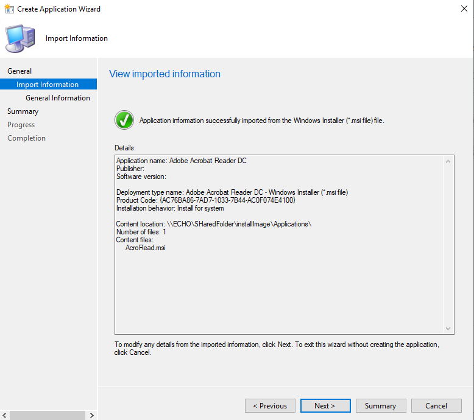

# Documentatie SCCM

## Gebruikte scripts & bestanden

- Link naar Powershell script voor installeren roles & features: [Powershell script install_roles_and_features](./install_roles_and_features.ps1)
- Link naar XML file voor installeren roles & features: [XML file DeploymentConfigTemplate](./DeploymentConfigTemplate.xml)
- Link naar Powershell script voor setup ADK & WDS: [Powershell script setup_adk_and_wds](./setup_adk_and_wds.ps1)
- Link naar Powershell script voor joinen domein: [Powershell script join_domain](./join_domain.ps1)
- Link naar Powershell script voor installeren SQL Server: [Powershell script install_sql_server_2017](./install_sql_server_2017.ps1)
- Link naar Powershell script voor installeren WSUS: [Powershell script install_roles_and_features_WSUS](./install_roles_and_features_WSUS.ps1)
- Link naar XML file voor installeren WSUS: [XML file DeploymentConfigTemplate_WSUS](./DeploymentConfigTemplate_WSUS.xml)
- Link naar Powershell script voor installeren SCCM: [Powershell script install_SCCM](./install_SCCM.ps1)
- Link naar Powershell script voor configureren SCCM: [Powershell script configure_SCCM](./configure_SCCM.ps1)
- Link naar Powershell script voor installeren MDT: [Powershell script install_MDT](./Install_MDT.ps1)

## VM aanmaken Virtualbox

Allereerst gaan we een nieuwe machine in Virtualbox aanmaken. 
- Naam: Echo SCCM
- Versie: Windows 2019 (64 bit)
- Geheugen: 8192 MB
- Nieuwe VDI (Dynamisch gealloceerd 100GB)

Netwerkinstellingen  
- 1 NAT Adapter
- 1 Intern netwerk adapter (intnet)

## Opstartconfiguratie

Windows Setup
- Language to Install: English
- Time and currency format: Dutch (Belgium)
- Keyboard or input method: Belgian (Period)
- Kies voor Windows Server 2019 Standard Evaluation (Desktop Experience)
- Password: Project3

## Map voor scripts

Op de C schijf van deze virtuele machine maken we een map aan genaamd scriptjes. In deze map zullen we al onze scripts stoppen die we gaan gebruiken voor de installatie en configuratie van alles.

## Rename Computer

Als eerste gaan we onze Computer / Server een juiste naam geven aan de hand van een mini scriptje. 
- Run `rename_computer.ps1`
- De Computer / Server herstart en zal nu de correcte naam hebben: `echo`

## Join Domain

Verder gaan we nu het domain CORONA2020.local joinen. Hiervoor moet onze DC en DNS server draaien. Met dit script gaan we ook onze SCCM het juiste ip adres geven.
- Run `join_domain.ps1`
- De Computer / Server zal nu herstarten.

## Install roles and features

Als volgende role gaan we enkele roles en features installeren.
- Run `install_roles_and_features.ps1`. Dit script installeert de roles `Web Server (IIS), het .NET Framework 3.5 Features en .NET Framework 4.7 Features, WCF Services, Background Intelligent Transfer Service (BITS), Remote Differential Compression, Remote Server Administration Tools, ...`
- Dit kan even duren, maar de server moet niet herstart worden hierna.

## Install Windows ADK & WDS

Ook moeten Windows ADK en WDS geïnstalleerd worden op onze server.
- Run `setup_adk_and_wds.ps1`. Dit script download en installeert niet enkel ADK en de windows PE Addon, maar installeert ook WDS.

## Install SQL Server

Ook een belangrijk deel van de SCCM server is het installeren van SQL Server.
- Zorg ervoor dat de installatiemedia in de juiste drive van de VM zit, anders zal het script niet werken.
- Hiervoor runnen we het script `install_sql_server_2017.ps1`
- Als het script is uitgevoerd is het een goed idee om de server eens te herstarten.

## Install and configure SCCM

Natuurlijk moeten we op de SCCM server ook SCCM zelf installeren.
- Run het script `install_SCCM.ps1`
- Tijdens de uitvoer van dit script wordt er gevraagd om het schema uit te breiden. Hier zeg je yes en log je in met de Administrator gegevens. Het script gaat nu verder met de installatie.
- Je kan ondertussen gerust iets anders gaan doen, het uitvoeren van dit script duurt namelijk enorm lang.
- Als het script is uitgevoerd, is het een goed idee om de server eens te herstarten.
- Vervolgens run je het script `configure_SCCM.ps1`

## MDT installeren

Ook moeten we MDT installeren aan de hand van een script.
- Run `Install_MDT.ps1`
- Herstart de server.

## MDT SCCM Integreren

Er moeten natuurlijk ook een aantal zaken manueel gebeuren. Als eerste gaan we MDT integreren in SCCM. Hiervoor openen we het programma "Configure ConfigMgr Integration". We vullen alles in zoals in onderstaande afbeelding en klikken op next. Nu is MDT geïntegreerd in SCCM.  

## Task Sequence

### Voorbereiden van de Task Sequence

Vervolgens gaan we een Task Sequence aanmaken om Windows 10 te deployen.

- Als eerste moeten we een gedeelde map aanmaken.
    - Op de C schijf maak je een map met als naam `CoronaShare`
    - Vervolgens rechtermuisklik je op `CoronaShare`, ga je naar properties, naar de tab sharing en klik je op share.
    - Controleer of het pad naar de map `\\ECHO\CoronaShare` is.
    - Klik op done.

- Vervolgens moeten we de nodige mappen aanmaken.
    - Maak de lege map `MDT Toolkit Package`
    - Maak de lege map `MDT Settings Package`
    - Maak de map `InstallImage` met `install.wim` en een map `Applicaties`met daarin de acrobat reader msi file.

- We moeten install.wim ook toevoegen in SCCM
    - In SCCM navigeer je naar `Software Library` en selecteer je `Operating Systems`
    - Rechtermuisklik op `Operating System Images` en klik vervolgens op `Add OS Image`
    - Navigeer naar `\\CoronaShare\InstallImage\install.wim` en selecteer `install.wim`. Klik op next.
    - Bij tab general klik je op next en bij tab summary klik je ook op next.

### Aanmaken Task Sequence

- Vervolgens ga je de task sequence aanmaken. 
    - In `Software Library` ga je naar `Operating Systems` en rechtermuisklik je op `Task Sequences`. Je selecteert `Create MDT Task Sequence`
    - Vervolgens selecteer je `Client Task Sequence` en klik je op next.
    - Je geeft de Task Sequence een naam en klikt op next.
    - Vervolgens selecteer je `Join a domain` en vul je bij domain `CORONA2020.local` in.
    - Bij `Set Account` geef je als username `CORONA2020\Administrator` en als password `Project3`. Vervolgens klik je op ok.
    - Bij `Windows Settings` geef je als username `CORONA IT` en als organisation name `Corona`
    - Het Administrator Account moet je enablen en als password kies je opnieuw voor `Project3`. Vervolgens klik je op confirm en daarna op next.
    - Capture Settings, Default = Never. Klik op next.
    - Specify Existing Boot Image, je browsed naar ...x64, klikt op ok en vervolgens op next.
    - MDT Package, Selecteer `Create new MDT Toolkit Package`. Vervolgens geef je het pad naar de juiste map `\\ECHO\CoronaShare\MDT Toolkit Package` en klik je op next.
    - MDT Details geef je als naam `MDT Toolkit Package` en je klikt op next.
    - OS Image, bij `Specify an Existing OS image` kies je voor de juiste Windows Versie. In ons geval `Windows 10 Entreprise Evaluation` en je klikt op next.
    - Als Deployment Method selecteer je `Perform a user driven installation` en klik op next.
    - Als client package selecteer je `Micr. Corp. Config. Man. Client Pack` en klik je op next.
    - Als USMT package selecteer je `Micr. Corp. User State Migr. Tool for Windows 10.0...` en klik je op next.
    - Als settings package selecteer je `Create new settings package`, je vult het pas in `\\ECHO\CoronaShare\MDT Settings Package` en klikt op next.
    - Bij settings details vul je als naam `MDT Settings Package` in en klik je op next.
    - Bij Sysprep package kies je voor `No sysprep package is required` en je klikt op next.
    - Vervolgens krijg je de summary. Je klikt op next en als laatste op finish.

### Applicatie toevoegen aan Task Sequence

- Ter illustratie willen we ook een applicatie toevoegen aan onze Task Sequence.
    - Je navigeert naar `Software Library` en selecteert `Application Management`.
    - Vervolgens rechtermuisklik je op `Applications` en selecteer je `Create application`.
    - Je gaat naar het pad `\\ECHO\SharedFolder\installImage\Applications\AcroRead.msi`. Vervolgens klik je op next. Daarna nog eens op next.
    - Bij `Installation Program` maak je van /q /qn en voeg je /norestart toe op het einde.
    - Bij `Install Behavior` selecteer je `Install for system` en klik je 2 maal op next en vervolgens op close.

### Aanpassen Task Sequence

- We gaan de auto apply drivers uitschakelen aangezien de client pc niet gebruikt zal worden in dit geval. 
    - Rechtermuisklik op de gemaakte Task sequence en slecteer edit.
    - Vervolgens navigeer je naar `Post Install` en selecteer je `Auto Apply Drivers`. Je navigeert naar het tab OPTIONS EN SELECTEERT `Disable this step`
    - Je klikt op apply.

- We moeten ook onze applicatie toevoegen aan de task sequence.
    - Navigeer naar `State Restore` en ga naar `Install Applications`. Hier selecteer je `Install Application`.
    - Vervolgens selecteer je `Install the following applications` en klik op het sterretje. Vink Acrobat Reader aan en klik op ok.
    - Klik op Apply en vervolgens op OK.

## WDS
- We hebben ook WDS nodig.
    - Je start Windows Deployment Services en rechtermuisklikt op de server echo.corona2020.local.
    - Vervolgens kies je voor `Configure Server` en klikt op next.
    - Je selecteert `Integrated with Active Directory` en klikt op next.
    - Vervolgens klik je nogmaals op next. Bij `PXE Server Initial Settings` kies je voor `Respond to all client computers (known and unknown)` en klikt op next.
    - Als laatste klik je op finish.

## DHCP

- Ook op de domaincontroller moeten we nog een kleinigheid toevoegen in verband met DHCP.
    - Op de DC open je DHCP en je navigeert naar `Scope options`. Je rechtermuisklikt hierop en kiest voor `Configure options`.
    - Je selecteert `066 Boot Server Host Name` en vult hier `echo` in.
    - Je selecteert ook `067 Bootfile name` en vult hier `boot\x64\wdsnbp.com` in. en klikt op apply.

## Client

- Als laatste stap moeten we natuurlijk de client aanmaken in Virtualbox.
    - Naam: Windows Client
    - Versie: Windows 10 (64 bit)
    - Geheugen: 4096 MB
    - Nieuwe VDI (Dynamisch gealloceerd 50GB)

    - Netwerkinstellingen  
        - 1 NAT Adapter
        - 1 Intern netwerk adapter (intnet)

    - Moederbord
        - Boot order
            - Netwerk
            - Harde Schijf

Als je deze Vm opstart zou deze met PXE boot moeten opstarten. Maar aangezien dat niet lukt met Virtualbox, is dit het verste dat we kunnen gaan.

## Bronnen

Hier zijn een aantal bronnen die ik tot nu toe gebruikt heb om een aantal taken te realizeren:

- (https://www.windows-noob.com/forums/topic/16614-how-can-i-install-system-center-configuration-manager-current-branch-version-1902-on-windows-server-2019-with-sql-server-2017-part-1)
- (https://www.youtube.com/watch?v=68wnQTdUOoc&ab_channel=ITTraningTutorial)
- (https://www.prajwaldesai.com/integrating-microsoft-deployment-toolkit-with-configuration-manager/)
- (https://petri.com/add-computer-to-domain-powershell)

## Screenshots

Hier kan je enkele screenshots zien van het werk.

### Script install_roles_and_features.ps1 in werking

### Aantonen dat de roles en features geïnstalleerd zijn

  

### Script setup_adk_and_wds in werking

### Aantonen dat downloaden van adksetup en adkwinpesetup.exe gelukt is

### Aantonen dat echo in het domein CORONA2020.local zit

  

### Aantonen dat SQL Server 2017 geïnstalleerd is

### Aantonen dat WSUS geïnstalleerd is

### Aantonen dat SCCM geïnstalleerd is

### MDT Task Sequence

  

### Create Application

  
