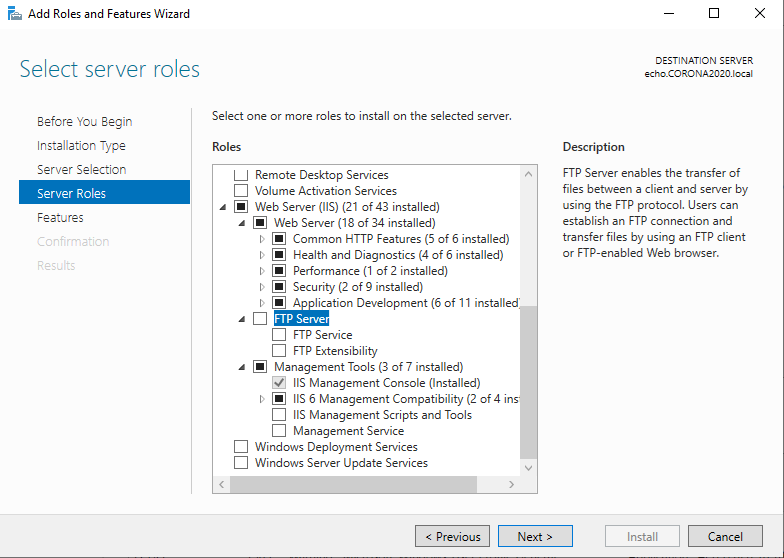

# Testrapport SCCM

  - Uitgevoerd: 04/12/2020
  - Tester: Sven De Vuyst
 
 ## Opstelling 
 
- Aanmaken van de opstelling is volledig gelukt en er zijn geen problemen ondervonden.
- **Opmerking:** Ik heb hier gekozen voor een `Bridged adapter` in plaats van `intnet` vanwege de opstelling die we in de klas waarschijnlijk moeten doen.
 
 ## Opstartconfiguratie
 
- Configuratie volledig doorlopen zonder problemen, de server start correct op.

 ## VirtualBox Guest Additions
 
- `VirtualBox Guest Additions` werd correct toegevoegd en dan geïnstalleerd.
- Na het doorlopen van de stappen is de gedeelde map zichtbaar.

## Persoonlijke map

- De map in de C schijf is aangemaakt en alle bestanden van de gedeelde map zijn hier ingezet.

## Rename Computer

- We gaan hier het script `rename_computer` runnen met `Windows Powershell`
- De server herstart en na dat deze terug is opgestart zien we dat de computernaam nu `echo` is.

## Join Domain

- Ik heb de DC `alfa` en de DNS `bravo` opgestart.
- Het script `join_domain.ps1` werd gerunned -> Het script heeft 2x moeten runnen voor de Server opnieuw wou opstarten.
- Na dat het script gerunt heeft controleren we Ethernet Adapter `Ethernet 2` deze heeft het IP `192.168.55.6` correct gekregen en zijn instelling staan juist.
- We controleren nu in Server Manager of `echo` in het domein zit en hier staat correct dat deze server in het domein `CORONA2020.local` zit.
- **Opmerking:** Controleer voor je het script uitvoert of je Ethernet adapters juist staan. NAT moet `Ethernet` zijn en de Bridged Adapter moet `Ethernet 2` zijn. Als dit niet zo is zal dit problemen geven.
 
## Install roles and features

- Als ik het script `install_roles_and_features.ps1` probeerde uit te voeren wou dit eerst niks doen. -> Kijken naar de code in het script via Powershell IDE.
- Als ik het script probeerde uitvoeren in Powershell IDE kreeg ik de error `C:\scriptjes\xml\DeploymentConfigTemplate.xml not found, please fix and try again.`
- Hier aan zag ik dat de foldernaam niet is aangepast in het script. `C:\scriptjes\xml` -> `C:\Scripts`
- **Opmerking:** Als je hier een fout krijgt `D:\sources\sxs not found, please fix and try again.` dan moet je in VirtualBox eens gaan kijken en zorgen dat bij `SATA-poort 1` terug je Windows Server 2019 iso file staat en niet de iso file van Guest Additions. Na dat we dit oplossen werkt het script volledig.
- Als we nu gaan kijken bij Server Manager zien we dat de alle roles and features die we nodig hebben correct zijn geinstaleerd.

 
## Install Windows ADK & WDS

- Het script `setup_adk_and_wds.ps1` werd gerund.
- `WDS` is correct geinstaleerd en valt terug te vinden in Server Manager.
- `ADK` is correct geinstaleerd en valt terug te vinden onder de C schijf.
- `Windows PE` valt ook terug te vinden onder de C schijf.

## Install SQL Server

- Het script `install_sql_server_2017.ps1` werd gerund.
- Als het script klaar is ga ik kijken bij de C schijf en bij het startmenu en zie ik `Microsoft SQL Server 2017` correct geinstaleerd staan.

## Install and configure SCCM

- Het script `install_SCCM.ps1` werd gerund. 
- **Opmerking:** Het script wou niet uitgevoerd worden vanwege het missen van de map `MEM_Configmgr_2002` in de C schijf in het mapje `Source`.
- Na het toevoegen van deze map wou het script wel runnen. Er werd `yes` ingevoerd bij het schema uitbreiden en de Administrator gegevens `CORONA2020\Administrator` met wachtwoord `Project3` werden ingevuld.
- Na een tijd wachten kunnen we bij het startmenu zien dat `Configuration Manager Console` is geinstaleerd. Als we deze aanklikken opent `Microsoft Endpoint Configuration Manager` (Dit is SCCM maar de laatste update er van.)

## Install MDT

- Het script `Install_MDT.ps1` werd gerund en de server is geherstart.
- Na het heropstarten van de server zien we in het Startmenu `Microsoft Deployment Toolkit` en `Deployment Workbench` staan wat een teken is dat MDT correct geinstaleerd is.

## MDT SCCM integration

- Het programma `Configure ConfigMgr Integration` werd gerund, dit staat onder het Startmenu bij `Microsoft Deployment Toolkit`
- Alle gegevens zoals `Site server name` en `Site code` die moeten ingevuld zijn staan al volledig klaar en we kunnen meteen de integration finishen.

## Task Sequence

### Voorbereiden van de Task Sequence

- Het aanmaken van de folder `CoronaShare` lukt.
- Het netwerkpad van deze Share is correct ingesteld als `\\ECHO\CoronaShare`.
- Het aanmaken van de mappen `MDT Toolkit Package`, `MDT Settings Package`, `InstallImage` en `Applicaties` lukt.
- `install.wim` is gevonden bij de installatiemedia van Windows 10 en dan geplaatst geplaatst in de map `InstallImage`.
- **Opmerking:** Vergeet de installatiemedia van Windows 10 niet in te steken in VirtualBox anders kan je de foute `install.wim` file hebben of niet vinden.
- De Acrobat Reader msi file werd gedownload van het internet en dan geplaatst in de map `Applicaties`.
- SCCM werd correct geopend, het navigeren naar de juiste plaats is correct gebeurd.
- Het pad `\\CoronaShare\InstallImage\install.wim` bleek niet te werken bij het toevoegen van een nieuwe OS Image dus heb ik het veranderd naar `\\ECHO\CoronaShare\InstallImage\install.wim`
- De wizard werd correct uitgevoerd en we zien nu onze image bij `Operating System Images` staan.

### Aanmaken Task Sequence

- De task sequence aanmaken is volledig correct verlopen en op het einde zie ik dat het process succesvol volledig doorlopen is.
- Het enige verschil bij deze Task Sequence was dat ik een andere versie van Windows gebruik als OS Image aangezien ik niet dezelfde heb staan.
- Na finish te klikken zien we onze task sequence `CoronaSequence` staan bij de Task Sequences van SCCM.

### Applicatie toevoegen aan Task Sequence

- Er werd correct naar `Software Library` genavigeerd en op `Application Management` geklikt.
- Hierna hebben we een nieuwe Applicatie aangemaakt door te rechterklikken op `Application Management` en `Create application` te kiezen.
- Ik heb een iets anders pad gebruikt dan bij het testplan maar het komt op hetzelfde neer: `\\ECHO\CoronaShare\Applicaties\AcroRead.msi`
- /q werd correct vervangen door /qn bij het `Installation Program` scherm en `Install for system` werd geselecteerd bij `Install Behavior`
- De applicatie werd correct toegevoegd aan de Task Sequence. We zien deze applicatie nu ook staan onder `Applications` bij SCCM.

### Aanpassen Task Sequence

- Na het navigeren naar de Task Sequence hebben we deze geedit en is `Auto Apply Drivers` correct uitgeschakelt.
- We hebben dan verder genavigeerd naar `State Restore` en hier hebben we `Install Application` gevonden. 
- `Install the following applications` werd correct geselecteerd en na op het sterretje te klikken zagen we Acrobat Reader staan, deze werd aangeklikt en dan Geapplied.
- Het aanpassen van de task sequence is correct verlopen zonder fouten.

## WDS

- Er werd genavigeerd naar `Server Manager` en vervolgens op `Windows Deployment Services` geklikt.
- De wizard werd correct doorlopen en na het finishen zien we dat de Server geconfigureerd staat door de extra settings die verschijnen in WDS.

## DHCP

- De DC werd geopend en er is correct genavigeerd naar `DHCP`
- De 2 scope options werden correct toegevoegd aan de DHCP Scope Options op de DC.

## Client

- De client werd correct aangemaakt
- Aangezien volgens het testplan deze VM met PXE boot zou moeten opstarten maar die niet lukt vanwege Virtualbox is dit het einde van het Testrapport.

## Einde

